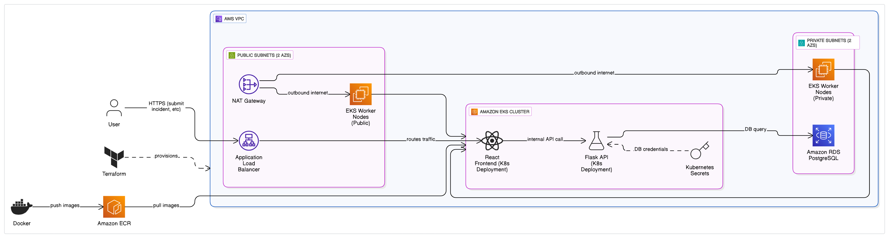
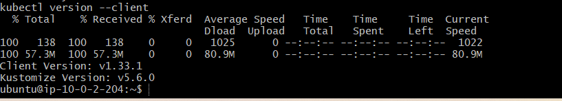

# 🛠️ Major Incident Tracker – 3-Tier Kubernetes App on AWS

[](https://www.terraform.io/)
[](https://aws.amazon.com/)
[](https://www.docker.com/)
[](https://flask.palletsprojects.com/)
[](https://reactjs.org/)
[](LICENSE)

---

## 📝 Project Summary

This project is a production-style **3-tier web application** simulating a **Major Incident Tracker** for DevOps and IT operations teams. It allows logging and viewing infrastructure incidents via a **React frontend**, **Flask API backend**, and **PostgreSQL RDS database**, all deployed in a private VPC using **EKS on AWS**.

Infrastructure is provisioned with **Terraform**, workloads containerized with **Docker**, and deployed using **raw Kubernetes YAML** and **Helm** for the ALB controller. The app demonstrates real-world AWS experience including IAM, ALB integration, and secure service-to-database communication.

> ⚠️ **Note**: The React frontend was generated using AI-assisted tools. This allowed me to focus on infrastructure provisioning, backend development, Kubernetes deployments, and end-to-end system integration.
---

## 📚 Table of Contents

- [📽 Demo](#-demo)
- [🧱 Architecture](#-architecture)
- [🧰 Technologies & Services Used](#-technologies--services-used)
- [📦 Infrastructure Provisioning (Terraform)](#-infrastructure-provisioning-terraform)
- [🧾 Checking the AWS Console for EKS Cluster Creation](#-checking-the-aws-console-for-eks-cluster-creation)
- [🛠️ Manual Console Adjustments](#️-manual-console-adjustments)
- [⚙️ EKS & ALB Controller Setup](#️-eks--alb-controller-setup)
- [🔧 Backend Deployment (Flask API)](#-backend-deployment-flask-api)
- [🎨 Frontend Deployment (React UI)](#-frontend-deployment-react-ui)
- [✅ End-to-End Application Flow](#-end-to-end-application-flow)
- [🔍 How the App Works](#-how-the-app-works)
- [🔗 Connecting Frontend & Backend](#-connecting-frontend--backend)
- [❤️ Health Checks & Load Balancing](#️-health-checks--load-balancing)
- [📁 Project File Tree](#-project-file-tree)
- [🧠 Key Takeaways](#-key-takeaways)
- [🔭 Planned Improvements](#-planned-improvements)
- [👨‍💻 Author](#-author)

---

## 📽 Demo


> Demonstrates logging an incident via the frontend UI and confirming persistence in the backend.

---

## 🧱 Architecture

### 📸 Architecture Diagram



Internet  
  ↓  
AWS ALB (Helm Controller)  
  ↓  
React Frontend → LoadBalancer Service  
  ↓  
Flask API → ClusterIP Service  
  ↓  
PostgreSQL RDS (Private Subnet)  


> 🔐 **Networking Note**:  
> The PostgreSQL RDS instance is hosted in **private subnets**, while the frontend LoadBalancer (ALB) and EKS control plane are exposed via **public subnets**. The node group spans both to allow secure app-to-db communication without direct exposure.

---

## 🧰 Technologies & Services Used

- **Terraform** – Infrastructure provisioning
- **AWS EKS** – Managed Kubernetes cluster
- **Helm** – For ALB controller deployment
- **Amazon RDS (PostgreSQL)** – Relational DB backend
- **React** – Frontend UI
- **Flask** – Backend API
- **Docker** – Container packaging
- **IAM, VPC, ALB, Subnets** – Core AWS services

---

## 📦 Infrastructure Provisioning (Terraform)

```bash
terraform init
terraform plan
terraform apply 
```

**Screenshots:**
- ### Terraform Init

- ### Terraform Plan

- ### Terraform Apply

- ### RDS Apply Output

- ### Terraform Outputs


---

## 🧾 Checking the AWS Console for EKS Cluster Creation

After deploying the EKS infrastructure via Terraform, I verified the cluster and node group creation through the AWS Console.

### EKS Cluster


---

## 🛠️ Manual Console Adjustments

While the majority of the infrastructure was provisioned using Terraform, a few manual steps were necessary within the AWS Console to ensure full application functionality:

### 🔖 Tagged Public Subnets for ALB Discovery

To allow the AWS Load Balancer Controller to provision ALBs correctly, I manually tagged the public subnets used by EKS with:

`kubernetes.io/role/elb = 1`

This tag is required for ALB resources to be placed correctly by the controller.

### ❗ RDS Access Issue & Fix

The Flask backend initially couldn’t connect to the PostgreSQL RDS instance. To resolve this, I modified the RDS security group to **allow inbound access on port 5432 from the EKS Node Group's security group**. This ensured secure, private communication between the Kubernetes pods and the RDS instance hosted in private subnets.

> 📸 Screenshot:  
> ### Testing RDS Connection from Pod


---

## ⚙️ EKS & ALB Controller Setup

- Generate kubeconfig & check nodes  
- Setup IAM OIDC & ALB policy  
- Install ALB controller via Helm  

Screenshots:  
- ### Build Kubeconfig & Check Nodes
  
- ### EKS Node Group Running
  
- ### IAM OIDC Provider
  
- ### IAM Policy for ALB Controller
  
- ### Helm Install for ALB Controller
  
- ### ALB Controller Deployed


> ### 📦 Why Helm & ALB Controller?
> This setup follows AWS's recommended approach for managing external load balancers with EKS. The **AWS Load Balancer Controller**, installed via **Helm**, is the official method for provisioning and managing **ALBs** in Kubernetes. It enables advanced routing, integrates with IAM OIDC for secure access, and allows seamless traffic flow to services running in the EKS cluster.
> 
> The AWS Load Balancer Controller is responsible for dynamically provisioning **Application Load Balancers (ALBs)** for Kubernetes Ingress resources. Helm simplifies its installation by handling complex Kubernetes manifests and resource dependencies.  
>  
> In this project, the ALB controller automatically created and managed an external ALB that routes traffic from the internet to the frontend pods, making the application accessible to users.

---

## 🔧 Backend Deployment (Flask API)

> 📄 **Key Files:**
> - [`backend-deployment.yaml`](k8s/backend-deployment.yaml)
> - [`backend-service.yaml`](k8s/backend-service.yaml)
> - [`create-table-job.yaml`](k8s/create-table-job.yaml)
> - [`create-database-job.yaml`](k8s/create-database-job.yaml)
>   
> These Kubernetes manifests define the backend Deployment (`backend-deployment.yaml`), a ClusterIP Service for internal access (`backend-service.yaml`), and two Job resources (`create-database-job.yaml`, `create-table-job.yaml`) used to initialize the database and set up the required table for storing incident data.
>
> The database-specific Jobs enable automatic initialization of the schema during deployment, following Infrastructure-as-Code best practices. This approach eliminates the need for manual RDS access and ensures consistent, repeatable setup in a cloud-native environment.

### 🔐 Environment Variables & Secret Management

Secrets are created using `kubectl create secret` and injected via `envFrom`. For production, AWS Secrets Manager is recommended.

**Screenshots:**
- ### Creating DB Secrets

- ### Editing DB Secrets

- ### Applying and Restarting Backend

- ### DB Table Created

- ### Building Backend Docker Image

- ### Tagging Backend Image for ECR

- ### Backend Docker Image Push

- ### Localhost Incident Testing

- ### Port Forwarding Backend

- ### Testing Curl Connection to Backend


---

## 🎨 Frontend Deployment (React UI)

### 💡 How the Frontend Works (React)

Although the frontend UI was generated using AI tools, it was fully integrated, tested, and containerized within the project. Here’s how it operates:

- Built using **React**, the frontend is served through **Nginx** inside a Docker container.
- Users can **submit incidents via a form**, which sends a `POST` request to `/api/incidents` (proxied to the Flask backend).
- A `GET` request to the same endpoint retrieves and **displays all logged incidents** in real-time.
- Routing and API logic are handled within React’s component state and lifecycle hooks.

This reflects a typical **single-page application (SPA)** pattern, using RESTful APIs for communication and state updates.

> 📄 **Key Files:**
> - [`frontend-deployment.yaml`](k8s/frontend-deployment.yaml)

**Screenshots:**
- ### NPM Install

- ### NPM Build

- ### Building Frontend Docker Image

- ### Tagging Frontend Docker Image

- ### Frontend Image Pushed to ECR

- ### Frontend Pods Running

- ### Restarting Frontend Deployment

- ### Tagging ALB to Subnets


---

## ✅ End-to-End Application Flow

1. User accesses frontend via ALB
2. Submits an incident
3. Frontend calls Flask backend
4. Backend writes to RDS
5. Incident is returned & displayed

**Screenshots:**
- ### Live App – Incident Logged


---

## 🔍 How the App Works

- Frontend exposed via ALB
- API runs behind ClusterIP
- RDS in private subnet
- Traffic flows securely via EKS services

---

## 🔗 Connecting Frontend & Backend

The React frontend and Flask backend communicate seamlessly within the Kubernetes cluster using REST API calls. This connection is made possible through:

- ✅ **Nginx Reverse Proxy**:  
  The frontend container includes a custom [`nginx.conf`](frontend/nginx.conf) that proxies any API requests (e.g., `/api/incidents`) to the backend service. This prevents CORS issues and enables clean routing in a production-like environment.

- ✅ **Service Discovery in Kubernetes**:  
  Kubernetes services (`ClusterIP`) allow internal DNS-based discovery between pods. The Nginx proxy forwards requests to the backend using the Kubernetes service name (`http://backend-service:5000`), ensuring decoupled but connected components.

- ✅ **Consistent Environment Variables**:  
  Both frontend and backend containers rely on shared environment variables or service references to ensure that API endpoints resolve correctly in-cluster.

This setup reflects a **real-world microservice architecture**, where different application tiers communicate securely and efficiently across a private network.

---

### ❤️ Health Checks & Load Balancing

To ensure high availability, **two levels of health checks** are implemented:

- **Application Load Balancer (ALB) Health Check**:  
  The ALB routinely sends HTTP requests to the `/health` endpoint exposed by the frontend container (via Nginx). This allows the ALB to verify that the application is responsive before routing traffic.

- **Backend Pod Readiness Probe**:  
  The Flask backend exposes a `/health` endpoint that responds with a `200 OK` if the application is up. Kubernetes uses this as a readiness probe to ensure the pod is ready before accepting traffic from internal services.

These checks work together to ensure that only healthy, responsive containers serve user requests — improving fault tolerance and uptime.

---

## 📁 Project File Tree


---

## 🧠 Key Takeaways

- Deployed full 3-tier app to EKS
- Used Terraform for AWS infra
- Integrated Helm for ALB controller
- Solved real-world RDS connectivity issues
- Gained practical DevOps + Kubernetes experience

---

## Jenkins CI/CD Pipeline

### Overview of the Pipeline

This section documents the Jenkins CI/CD pipeline used to automate the build, push, and deployment of the Major Incident Tracker application.

The pipeline is driven by the `Jenkinsfile` located in the root of the GitHub repository. It automates the following steps:

- **Build backend and frontend Docker images** based on the application source code.  
- **Push the images to AWS Elastic Container Registry (ECR)**.  
- **Update the Kubernetes deployments** running in Amazon EKS using `kubectl set image`, triggering a rolling update of the pods.

The goal is to provide a repeatable and automated way to deploy new application versions into the cluster with minimal manual intervention.

---

## EC2 Instance Setup and IAM Role

A dedicated EC2 instance was provisioned to host Jenkins:

- **Ubuntu 24.04 LTS**  
- Security group allowing:  
  - Port **22** for SSH  
  - Port **8080** for Jenkins web interface  
- An **IAM Role** was attached to the EC2 instance to allow:  
  - Pushing/pulling Docker images to/from ECR  
  - Interacting with EKS via `kubectl`

### EC2 Security Group and Role Attached


### EC2 Security Group Inbound Rules


### IAM Role and Permissions Attached to Jenkins EC2


---

## Installing Required Packages on EC2 via SSH

The following packages were installed on the Jenkins EC2 instance to support the pipeline operations:

- **Installing Docker**  
  

- **Installing AWS CLI**  
  

- **Installing kubectl**  
  

- **Installing Node.js and npm**  
  

---

## Enabling and Starting Jenkins


## Verifying Jenkins is Running


---

## Preparing the Application

To simulate the application being live, I manually re-applied the Kubernetes deployment YAML files before testing the pipeline:

```bash
kubectl apply -f backend-deployment.yaml
kubectl apply -f frontend-deployment.yaml
```

### Applying Kubernetes Deployment YAML Files


---

## Before Pipeline Run — Baseline Checks

### Kubernetes Deployments and Pods Before Jenkins Build


---

## Running the Jenkins Pipeline

The Jenkins pipeline was configured to pull the code from GitHub and execute the stages defined in the `Jenkinsfile`. The screenshot bellow shows access credential secrets for AWS and Github.

### Jenkins Pipeline Configuration — GitHub Credentials


### Jenkins Global AWS & GitHub Credentials


### Jenkins Pipeline Idle State Before Build


---

## After Pipeline Run — Verifying Results

### Jenkins Stages Success — Stages View


### Jenkins Pipeline Success — Console Log Output


---

## After Pipeline Run — Post-Deployment Checks

### Backend ECR After Jenkins


### Frontend ECR After Jenkins


### Kubernetes Deployments After Jenkins


### Kubernetes Pods After Jenkins


---

## Handling Dummy Secrets for Backend Pod Startup

Since the RDS instance was not live during this test, a dummy Kubernetes Secret was created to allow the backend pods to start correctly:

### Creating Dummy Secret


---

## Final Summary

This Jenkins CI/CD pipeline successfully automated the build and deployment workflow for my Major Incident Tracker application:

✅ Build backend and frontend Docker images  
✅ Push images to ECR  
✅ Update Kubernetes deployments in EKS  
✅ Perform zero-downtime rolling updates of pods  
✅ Fully automated pipeline flow — tested and validated  

---

## Key Benefits of this CI/CD Setup

- Provides a **repeatable deployment process** integrated with GitHub source control.  
- Uses **AWS native services** (ECR, EKS, IAM) securely.  
- Demonstrates **infrastructure automation and CI/CD best practices**.  
- Supports **rolling updates** with no manual redeployment of Kubernetes resources required.

---

## 👨‍💻 Author

**Harvey Aland**  
AWS Certified Solutions Architect – Associate  
[GitHub](https://github.com/HarveyAland) • [LinkedIn](https://www.linkedin.com/in/harvey-aland-172542295)
